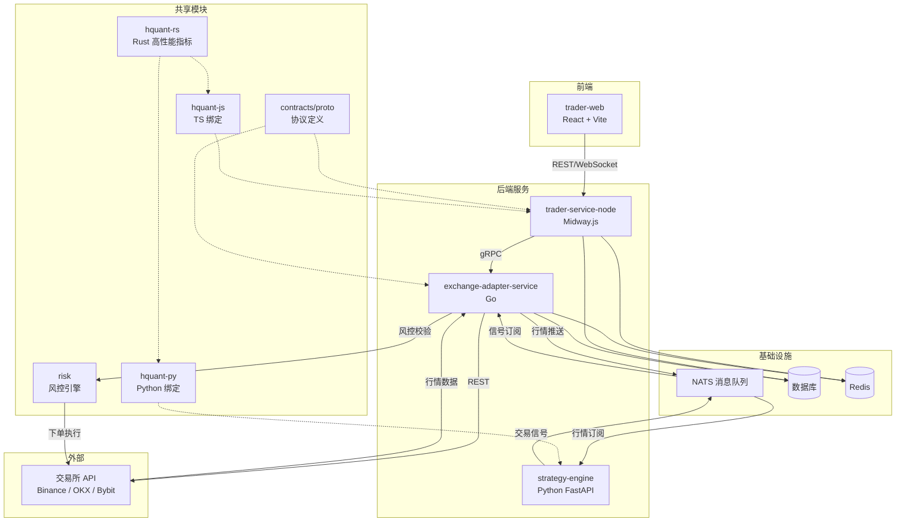

# Auto Trader - 量化交易平台

一个多语言微服务架构的量化交易平台，覆盖行情接入、策略执行、交易下单与前端展示。

## 项目结构

```
auto-trader/
├── apps/                          # 可部署服务
│   ├── exchange-adapter-service/  # Go - 交易所适配与行情同步
│   ├── trader-service-node/       # Midway.js - 交易/用户 API
│   ├── trader-web/                # React + Vite 前端
│   ├── strategy-engine/           # Python - 策略引擎
│   └── chart-demo/                # 图表演示
├── packages/                      # 共享包
│   ├── contracts/                 # 协议定义 (Proto)
│   ├── hquant-js/                 # TS 指标/策略相关包
│   ├── hquant-py/                 # Python 指标/策略相关包
│   ├── hquant-rs/                 # Rust 高性能指标
│   ├── klinecharts-pro/           # K 线组件
│   ├── casdoor/                   # 认证/SSO (TS)
│   ├── casdoor-py/                # 认证/SSO (Python)
│   ├── logger-js/                 # JS 日志
│   └── logger-py/                 # Python 日志
├── pkg/                           # Go 共享库
├── docs/                          # 文档
└── certs/                         # 证书与密钥
```

## 系统架构流程图



### 核心数据流

```
交易所 → exchange-adapter-service → NATS(行情) → strategy-engine
  → NATS(信号) → exchange-adapter-service → 风控引擎 → 交易所(下单)
```

## 四个项目如何启动

### 1. exchange-adapter-service (Go)

```bash
cd apps/exchange-adapter-service
cp config.yaml config.local.yaml
# 按需修改 config.local.yaml（数据库/NATS/Redis）

docker compose up -d

go run ./cmd
```

### 2. trader-service-node (Node.js/Midway)

```bash
pnpm install

cd apps/trader-service-node
pnpm dev
```

### 3. trader-web (React/Vite)

```bash
pnpm install

cd apps/trader-web
pnpm dev
```

### 4. strategy-engine (Python)

```bash
cd apps/strategy-engine
poetry install

uvicorn app.main:app --host 0.0.0.0 --port 9002 --reload
```
